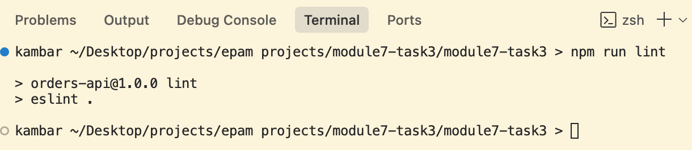
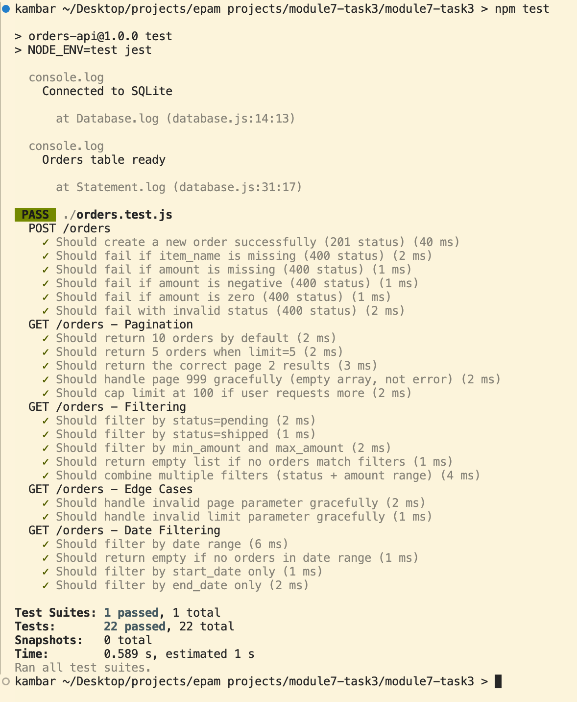
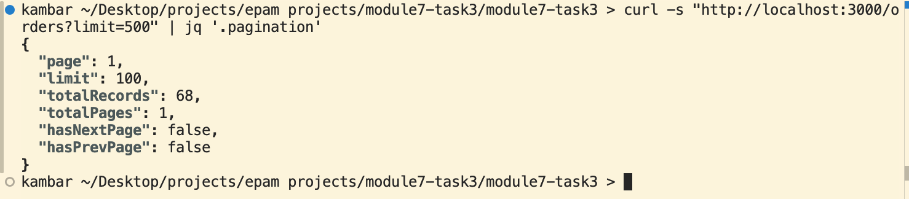
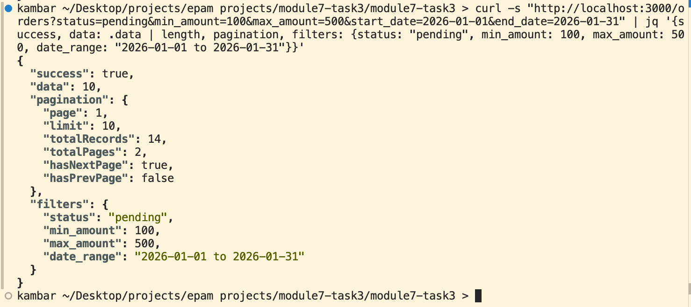

# Pagination Feature - Orders API (Task 4)

[](https://nodejs.org/)
[](https://expressjs.com/)
[](https://www.sqlite.org/)
[](https://jestjs.io/)
[](https://cursor.sh/)

---

## 🤖 AI-Assisted Development

This pagination feature was implemented using **Cursor AI Assistant**. Review the complete development metrics, AI contribution breakdown, and implementation process:

👉 **[📊 Cursor AI Assistant Report](./CURSOR_REPORT.md)**

*AI Contribution: 79% code generation, 82% time saved, 22 tests generated*

---

## 📋 Table of Contents

- [Overview](#-overview)
- [Pagination Feature](#-pagination-feature)
- [Quick Start](#-quick-start)
- [API Documentation](#-api-documentation)
- [Interactive API Documentation (Swagger UI)](#-interactive-api-documentation-swagger-ui)
- [Evidence Screenshots](#-evidence-screenshots)
- [Testing](#-testing)
- [Security](#-security)

---

## 🎯 Overview

This project implements **pagination and server-side filtering** for an existing Orders REST API. The feature was developed using **Cursor AI Assistant** as part of Module 7, Task 4.

### Feature Highlights

✅ **Pagination**: Page-based navigation with configurable limits  
✅ **Server-Side Filtering**: Status, amount range, and date range filters  
✅ **Input Validation**: Max limit enforcement (100), parameter validation  
✅ **SQL Injection Protection**: Parameterized queries and whitelist validation  
✅ **Comprehensive Testing**: 22 automated tests with 100% pass rate  
✅ **Production-Ready**: ESLint compliant, security hardened

### Base URL

```
http://localhost:3000
```

### Interactive Documentation

```
http://localhost:3000/api-docs
```

---

## 📄 Pagination Feature

### Implementation Details

**Modified Lines**: ~95 lines in `server.js`  
**AI Generated**: 79% (~75 lines)  
**Manual Fixes**: 21% (~20 lines - security hardening, edge cases)

### Key Parameters

| Parameter | Type | Default | Max | Description |
|-----------|------|---------|-----|-------------|
| `page` | integer | 1 | - | Page number (min: 1) |
| `limit` | integer | 10 | 100 | Items per page |
| `status` | string | - | - | Filter: `pending`, `shipped`, `delivered`, `cancelled` |
| `min_amount` | number | - | - | Minimum order amount (inclusive) |
| `max_amount` | number | - | - | Maximum order amount (inclusive) |
| `start_date` | string | - | - | Start date (YYYY-MM-DD format) |
| `end_date` | string | - | - | End date (YYYY-MM-DD format) |
| `sort_by` | string | `date_created` | - | Sort field: `id`, `date_created`, `amount`, `status`, `item_name` |
| `order` | string | `asc` | - | Sort direction: `asc` or `desc` |

### Response Metadata

```json
{
  "success": true,
  "data": [...],
  "pagination": {
    "page": 1,
    "limit": 10,
    "totalRecords": 50,
    "totalPages": 5,
    "hasNextPage": true,
    "hasPrevPage": false
  }
}
```

---

## 🚀 Quick Start

### Installation

```bash
# Clone repository
git clone https://github.com/mirmanoov/module7-task3
cd module7-task3

# Install dependencies
npm install

# Seed database with sample data
node seed.js

# Start server
npm start
```

Server runs at `http://localhost:3000`

### Run Tests

```bash
npm test
```

**Expected Output**: ✅ 22 tests passing

---

## 📚 API Documentation

### GET /orders - Retrieve Orders with Pagination

Retrieve orders with pagination, filtering, and sorting capabilities.

#### Request Examples

**Basic Pagination**
```bash
# Default (page 1, limit 10)
curl "http://localhost:3000/orders"

# Custom pagination
curl "http://localhost:3000/orders?page=2&limit=20"

# Max limit enforcement (500 → capped at 100)
curl "http://localhost:3000/orders?limit=500"
```

**Filtering**
```bash
# Filter by status
curl "http://localhost:3000/orders?status=pending"

# Filter by amount range
curl "http://localhost:3000/orders?min_amount=100&max_amount=500"

# Filter by date range
curl "http://localhost:3000/orders?start_date=2026-01-01&end_date=2026-01-31"

# Combined filters
curl "http://localhost:3000/orders?status=shipped&min_amount=50&start_date=2026-01-15"
```

**Sorting**
```bash
# Sort by amount (descending)
curl "http://localhost:3000/orders?sort_by=amount&order=desc"

# Sort by date (ascending)
curl "http://localhost:3000/orders?sort_by=date_created&order=asc"
```

#### Response Example

```json
{
  "success": true,
  "data": [
    {
      "id": 1,
      "item_name": "Laptop",
      "amount": 999.99,
      "status": "pending",
      "date_created": "2026-01-29T10:00:00.000Z"
    },
    {
      "id": 2,
      "item_name": "Mouse",
      "amount": 25.50,
      "status": "shipped",
      "date_created": "2026-01-29T11:00:00.000Z"
    }
  ],
  "pagination": {
    "page": 1,
    "limit": 10,
    "totalRecords": 50,
    "totalPages": 5,
    "hasNextPage": true,
    "hasPrevPage": false
  }
}
```

#### Error Responses

**Invalid Parameters**
```json
{
  "error": "Database error",
  "details": "Invalid date format"
}
```

### Other Endpoints

This API also includes:
- `POST /orders` - Create new order
- `PUT /orders/{id}` - Update order
- `DELETE /orders/{id}` - Delete order
- `GET /orders/export` - Export as CSV/JSON

Full documentation available at `http://localhost:3000/api-docs` (Swagger UI)

---

## � Interactive API Documentation (Swagger UI)

Access the interactive Swagger UI documentation at:

```
http://localhost:3000/api-docs
```

### Swagger Overview


The Swagger UI provides a complete interactive interface for testing all API endpoints. For Task 4, the most relevant endpoint is **GET /orders** which showcases the pagination and filtering features.

### GET /orders - Pagination Interface


The Swagger UI for GET /orders displays all query parameters including:
- **Pagination**: `page`, `limit` (max 100)
- **Filtering**: `status`, `min_amount`, `max_amount`, `start_date`, `end_date`
- **Sorting**: `sort_by`, `order`

### Example Response


The response includes:
- **data**: Array of order objects
- **pagination**: Metadata with `page`, `limit`, `totalRecords`, `totalPages`, `hasNextPage`, `hasPrevPage`

**Benefits of Swagger UI**:
- ✅ Test pagination parameters interactively
- ✅ Try different filter combinations
- ✅ See real-time response schemas
- ✅ Validate request/response formats

---

## �📸 Evidence Screenshots

### ESLint Compliance (0 Errors)

The code passes ESLint with **zero errors and zero warnings**, demonstrating production-ready code quality.



**Verification Command**: `npm run lint`

---

### Test Suite (22/22 Passing)

All 22 automated tests pass successfully, covering pagination, filtering, edge cases, and validation.



**Verification Command**: `npm test`

**Test Breakdown**:
- ✅ POST /orders: 6 tests
- ✅ GET /orders - Pagination: 5 tests (including max limit)
- ✅ GET /orders - Filtering: 5 tests
- ✅ GET /orders - Edge Cases: 2 tests
- ✅ GET /orders - Date Filtering: 4 tests

---

### Max Limit Enforcement

Requesting `limit=500` is automatically capped at the maximum of **100 items**, preventing resource exhaustion attacks.



**Test Command**:
```bash
curl "http://localhost:3000/orders?limit=500"
```

**Result**: `"limit": 100` (not 500) ✅

---

### Complex Filtering

Demonstrates combined filtering using **status**, **amount range**, and **date range** simultaneously.



**Test Command**:
```bash
curl "http://localhost:3000/orders?status=pending&min_amount=100&max_amount=500&start_date=2026-01-01&end_date=2026-01-31"
```

**Filters Applied**:
- Status: `pending`
- Amount: `100-500`
- Date Range: `2026-01-01` to `2026-01-31`

**Result**: 14 matching orders found ✅

---

## 🧪 Testing

### Test Suite Summary

**Total Tests**: 22 (exceeds Task 4 requirement of 10-15)  
**Pass Rate**: 100% (22/22 passing)  
**AI Generated**: 18 tests  
**Manual Additions**: 4 tests (edge cases)

### Test Coverage

| Category | Tests | Description |
|----------|-------|-------------|
| **POST /orders** | 6 | Create order validation |
| **Pagination** | 5 | Default, custom, max limit, edge cases |
| **Filtering** | 5 | Status, amount, date, combined filters |
| **Edge Cases** | 2 | Invalid params, out of bounds |
| **Date Filtering** | 4 | Date ranges, start/end only |

### Key Test Cases

✅ Default pagination (page=1, limit=10)  
✅ Custom pagination (page=2, limit=5)  
✅ **Max limit enforcement** (limit=500 → capped at 100)  
✅ Status filtering (pending, shipped, delivered)  
✅ Amount range filtering  
✅ Date range filtering  
✅ Combined filters  
✅ Invalid parameters handling  
✅ Out of bounds pagination (page=999)  
✅ Empty result sets

### Run Tests

```bash
npm test
```

**Expected Output**:
```
Test Suites: 1 passed, 1 total
Tests:       22 passed, 22 total
Time:        ~0.6s
```

---

## 🔒 Security

### SQL Injection Protection

✅ **Parameterized Queries**: All user inputs use `?` placeholders
```javascript
conditions.push('status = ?');
params.push(status);  // Safe: parameterized
```

✅ **Whitelist Validation**: Dynamic fields use whitelist approach
```javascript
const allowedSortFields = ['id', 'date_created', 'amount', 'status', 'item_name'];
const sortField = allowedSortFields.includes(sortBy) ? sortBy : 'date_created';
```

✅ **Hardcoded Order**: Sort direction limited to ASC/DESC
```javascript
const order = req.query.order === 'desc' ? 'DESC' : 'ASC';
```

### Input Validation

✅ **Max Limit Enforcement**: Prevents resource exhaustion
```javascript
if (limit > 100) limit = 100;  // Cap at 100 items
```

✅ **Parameter Validation**: Ensures valid ranges
```javascript
const page = Math.max(1, parseInt(req.query.page, 10) || 1);
limit = Math.max(1, limit);
```

✅ **Type Safety**: Strict type checking
```javascript
if (!Number.isNaN(minAmount)) { ... }  // No type coercion
```

### Additional Security

- **Rate Limiting**: 100 requests per 15 minutes
- **CORS**: Configured for cross-origin requests
- **Error Handling**: No sensitive data in error messages

---

## 📦 Tech Stack

| Category | Technology | Version | Purpose |
|----------|-----------|---------|---------|
| **Runtime** | Node.js | v18+ | JavaScript runtime |
| **Framework** | Express.js | v5.2.1 | Web framework |
| **Database** | SQLite | v5.1.7 | Embedded database |
| **Testing** | Jest | v29.7.0 | Test framework |
| **Testing** | Supertest | v6.3.4 | HTTP assertions |
| **Documentation** | Swagger UI | v5.0.1 | API documentation |
| **Documentation** | Swagger JSDoc | v6.2.8 | OpenAPI generator |
| **Security** | express-rate-limit | v8.2.1 | Rate limiting |
| **Export** | json2csv | v6.0.0 | CSV conversion |

---

## 📊 Database Schema

```sql
CREATE TABLE orders (
  id INTEGER PRIMARY KEY AUTOINCREMENT,
  item_name TEXT NOT NULL,
  amount REAL NOT NULL,
  status TEXT NOT NULL,
  date_created TEXT NOT NULL
);
```

**Sample Data**: 20 orders with various statuses and amounts (seeded via `seed.js`)

---

## 📝 Task 4 Requirements Checklist

### Pull Request (50 pts) ✅
- [x] Working pagination implementation (95 lines modified)
- [x] Page/limit parameters (defaults: page=1, limit=10, max=100)
- [x] Server-side filtering (status, amount, date range)
- [x] Offset calculation and metadata in response
- [x] Code passes linter (0 ESLint errors)
- [x] Ready to merge

### Tests (20 pts) ✅
- [x] 22 test cases (exceeds 10-15 requirement)
- [x] Coverage: pagination, filters, edge cases
- [x] All tests passing (22/22)

### Documentation (10 pts) ✅
- [x] Updated README with parameters
- [x] Request/response examples
- [x] Swagger UI documentation

### AI Assistant Report (20 pts) ✅
- [x] Tool identified (Cursor)
- [x] Interaction modes documented
- [x] AI contribution: 79%
- [x] Metrics: acceptance rate, time saved
- [x] Manual fixes documented
- [x] Clear AI vs manual distinction

---

