# 🛒 Orders Management API

[](https://nodejs.org/)
[](https://expressjs.com/)
[](https://www.sqlite.org/)
[](https://jestjs.io/)
[](https://swagger.io/)
---

## 🤖 AI-Assisted Development

This project was developed with the assistance of **GitHub Copilot**. You can review the full details of the AI's contributions, development metrics, and session analysis in the report below:

👉 **[🚀 GitHub Copilot Metrics Report](./COPILOT_REPORT.md)**

*Includes breakdown of code contribution (99.8%), development time saved (86.5%), and key learnings.*

---

## 📋 Table of Contents

- [AI-Assisted Development](#-ai-assisted-development)
- [Overview](#-overview)
- [Features](#-features)
- [Quick Start](#-quick-start)
- [API Endpoints](#-api-endpoints)
  - [GET /orders](#-get-orders---retrieve-orders)
  - [POST /orders](#-post-orders---create-order)
  - [PUT /orders/{id}](#️-put-ordersid---update-order)
  - [DELETE /orders/{id}](#️-delete-ordersid---delete-order)
  - [GET /orders/export](#-get-ordersexport---export-data)
- [Interactive Documentation (Swagger UI)](#-interactive-api-documentation-swagger-ui)
- [Testing](#-testing)
- [Rate Limiting](#-rate-limiting)
- [Security](#-security-features)
- [Project Structure](#-project-structure)
- [Tech Stack](#️-tech-stack)
- [Database Schema](#-database-schema)

---

## 🎯 Overview

The **Orders Management API** is a production-ready REST API designed for managing e-commerce orders with enterprise-grade features. Built with modern Node.js technologies, this API demonstrates best practices in:

- **RESTful Design**: Proper HTTP methods, status codes, and resource naming
- **Data Validation**: Comprehensive input validation with meaningful error messages
- **Security**: SQL injection prevention, rate limiting, and parameterized queries
- **Documentation**: Interactive Swagger UI with complete OpenAPI 3.0 specification
- **Testing**: 21 automated tests covering all endpoints and edge cases

### 🌐 Base URL

```
http://localhost:3000
```

### 📖 Interactive Documentation

```
http://localhost:3000/api-docs
```

---

## ✨ Features

### Core Functionality

| Feature | Description |
|---------|-------------|
| **Full CRUD Operations** | Create, Read, Update, and Delete orders through RESTful endpoints |
| **Advanced Pagination** | Navigate large datasets with customizable page size (1-100 items) |
| **Multi-Field Filtering** | Filter by status, amount range, and date range simultaneously |
| **Dynamic Sorting** | Sort by any field (id, date, amount, status, item_name) in ascending or descending order |
| **Data Export** | Download complete order data as CSV or pretty-printed JSON files |

### Enterprise Features

| Feature | Description |
|---------|-------------|
| **Rate Limiting** | Protect API from abuse with 100 requests per 15 minutes per IP |
| **Input Validation** | Comprehensive validation with detailed error messages |
| **SQL Injection Prevention** | All queries use parameterized statements |
| **Swagger Documentation** | Interactive API testing directly in the browser |
| **Comprehensive Testing** | 21 automated tests with Jest + Supertest |

---

## 🚀 Quick Start

### Prerequisites

Before you begin, ensure you have the following installed:

- **Node.js** v18.0.0 or higher ([Download](https://nodejs.org/))
- **npm** v9.0.0 or higher (included with Node.js)

### Installation

#### Step 1: Clone and Install Dependencies

```bash
# Navigate to the project directory
cd module7-task3

# Install all dependencies
npm install
```

This installs the following packages:
- `express` - Web framework
- `sqlite3` - Database driver
- `swagger-ui-express` & `swagger-jsdoc` - API documentation
- `express-rate-limit` - Rate limiting middleware
- `json2csv` - CSV export functionality
- `jest` & `supertest` - Testing framework

#### Step 2: Initialize the Database

```bash
# Create and seed the database with 50 sample orders
node seed.js
```

**Expected Output:**
```
Connected to SQLite database
Orders table created/verified
Inserted 50 sample orders
Database seeding complete!
```

The seed script creates orders with:
- Random item names (Laptop, Wireless Mouse, Gaming Keyboard, etc.)
- Prices ranging from $10.00 to $500.00
- Various statuses (pending, shipped, delivered, cancelled)
- Dates spanning the past 30 days

#### Step 3: Start the Server

```bash
# Production mode
npm start

# Development mode (with auto-reload)
npm run dev
```

**Expected Output:**
```
Connected to SQLite
Orders table ready
Server is running on http://localhost:3000
Swagger UI available at http://localhost:3000/api-docs
```

### Available Scripts

| Command | Description | Use Case |
|---------|-------------|----------|
| `npm start` | Start production server | Deployment, testing |
| `npm run dev` | Start with nodemon (auto-reload) | Development |
| `npm test` | Run all 21 test cases | CI/CD, validation |

---

##  API Endpoints

### Endpoint Summary

| Method | Endpoint | Description |
|--------|----------|-------------|
| `GET` | `/orders` | Retrieve orders with filtering, sorting, pagination |
| `POST` | `/orders` | Create a new order |
| `GET` | `/orders/export` | Export all orders (CSV or JSON) |
| `PUT` | `/orders/{id}` | Update order status and/or amount |
| `DELETE` | `/orders/{id}` | Delete an order |

---

## � Interactive API Documentation (Swagger UI)

This project includes **Swagger UI** — an interactive, browser-based API documentation and testing tool. Access it at:

```
http://localhost:3000/api-docs
```

### Swagger UI Overview

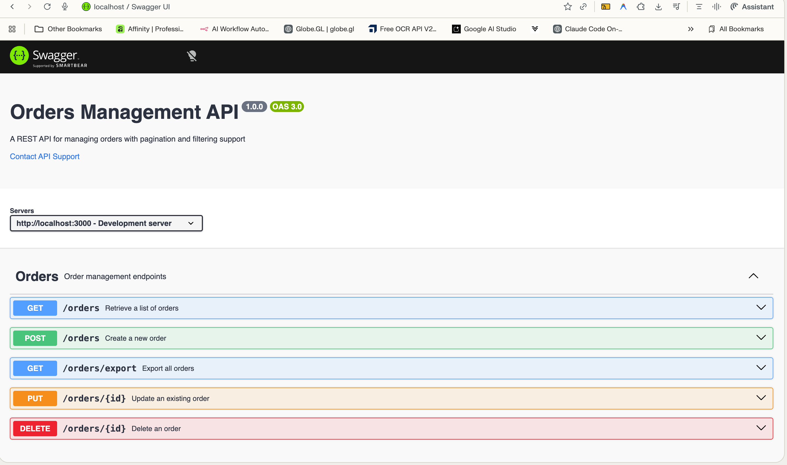

**What You See in Swagger UI:**

The main page displays all 5 API endpoints organized under the "Orders" tag:

| Color | Method | Endpoint | Description |
|-------|--------|----------|-------------|
| 🟦 Blue | `GET` | `/orders` | Retrieve orders with filtering, sorting, and pagination |
| 🟩 Green | `POST` | `/orders` | Create a new order |
| 🟦 Blue | `GET` | `/orders/export` | Export all orders as CSV or JSON |
| 🟧 Orange | `PUT` | `/orders/{id}` | Update an existing order |
| 🟥 Red | `DELETE` | `/orders/{id}` | Delete an order |

**Key Interface Elements:**

1. **API Title & Version**: "Orders Management API v1.0.0"
2. **Server Dropdown**: Select between development/production servers
3. **Expandable Endpoints**: Click any endpoint to see full documentation
4. **Schema Definitions**: View request/response structures

### How to Use Swagger UI

1. **Navigate** to `http://localhost:3000/api-docs`
2. **Click** on any endpoint to expand it
3. **Click "Try it out"** to enable input fields
4. **Fill in parameters** (query params, request body, path params)
5. **Click "Execute"** to send the request
6. **View the response** including status code, headers, and body

### Benefits

| Feature | Description |
|---------|-------------|
| **Interactive Testing** | Test all endpoints without writing curl commands |
| **Auto-Generated Curl** | Copy the exact curl command for each request |
| **Schema Visualization** | See request/response structures with examples |
| **Real-Time Responses** | View actual server responses with headers |
| **Rate Limit Monitoring** | Check remaining requests via response headers |

---

## �🔍 1. GET /orders - Retrieve Orders

Retrieve orders with powerful filtering, sorting, and pagination.

### Query Parameters

| Parameter | Type | Default | Description |
|-----------|------|---------|-------------|
| `page` | integer | `1` | Page number |
| `limit` | integer | `10` | Items per page (1-100) |
| `status` | string | - | Filter: `pending`, `shipped`, `delivered`, `cancelled` |
| `min_amount` | number | - | Minimum amount (inclusive) |
| `max_amount` | number | - | Maximum amount (inclusive) |
| `start_date` | string | - | Start date (YYYY-MM-DD) |
| `end_date` | string | - | End date (YYYY-MM-DD) |
| `sort_by` | string | `date_created` | Sort field: `id`, `date_created`, `amount`, `status`, `item_name` |
| `order` | string | `asc` | Sort direction: `asc` or `desc` |

### Response Schema

```json
{
  "success": true,
  "data": [
    { "id": 1, "item_name": "Laptop", "amount": 999.99, "status": "pending", "date_created": "2026-01-29T..." }
  ],
  "pagination": {
    "page": 1, "limit": 10, "totalRecords": 50, "totalPages": 5, "hasNextPage": true, "hasPrevPage": false
  }
}
```

### Examples

```bash
# Basic request (default pagination)
curl "http://localhost:3000/orders"

# Filter by status and sort
curl "http://localhost:3000/orders?status=pending&sort_by=amount&order=desc"

# Combined filters with pagination
curl "http://localhost:3000/orders?status=pending&min_amount=100&start_date=2026-01-01&page=1&limit=5"
```

### Swagger UI - GET /orders

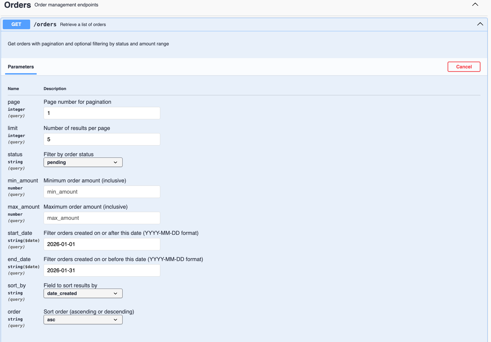

The expanded GET endpoint shows all 9 query parameters with types, descriptions, and default values. Parameters include pagination (page, limit), filters (status, min_amount, max_amount, start_date, end_date), and sorting (sort_by, order).

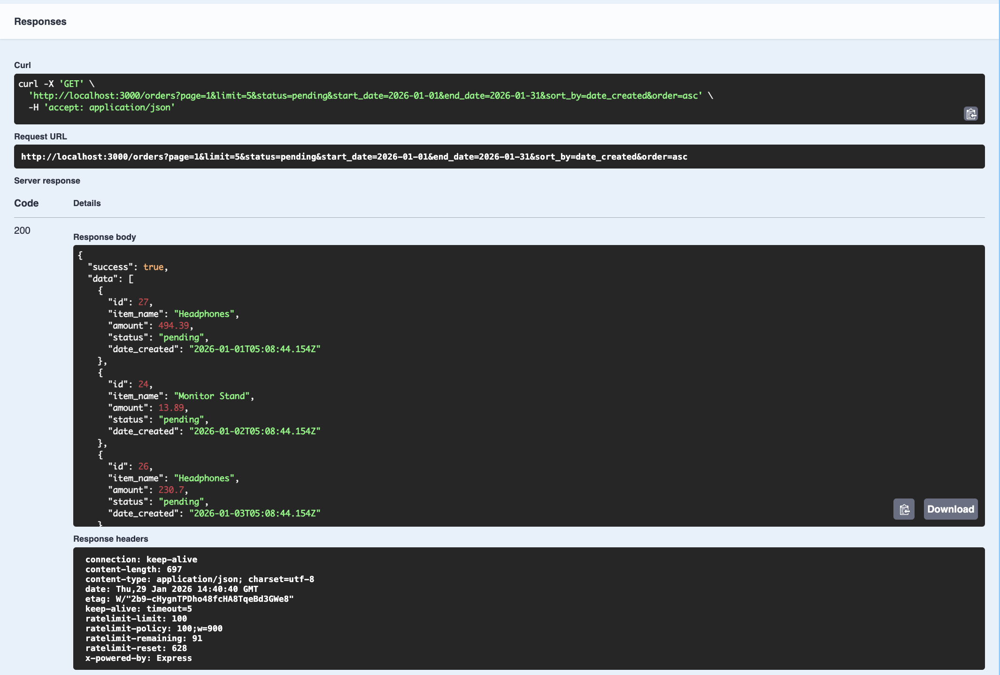

After clicking Execute, Swagger displays:
- The generated **curl command**
- **Request URL** with all query parameters
- **Response body** with filtered orders
- **Response headers** including rate limit information

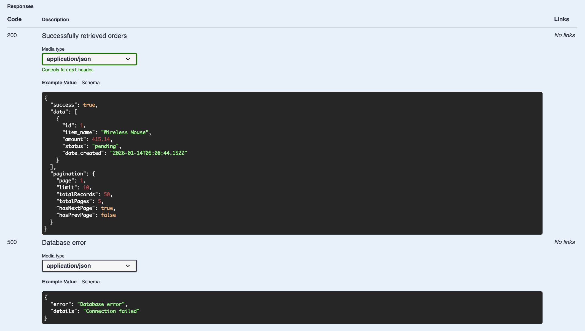

As shown in the screenshot above, the response schema includes pagination metadata and possible error responses (500 Database error).

---

## ➕ 2. POST /orders - Create Order

Create a new order with validation.

### Request Body

```json
{
  "item_name": "Laptop",    // Required: string
  "amount": 999.99,         // Required: number > 0
  "status": "pending"       // Required: pending|shipped|delivered|cancelled
}
```

### Response (201 Created)

```json
{
  "success": true,
  "message": "Order created successfully",
  "data": {
    "id": 51,                // Auto-generated
    "item_name": "Laptop",
    "amount": 999.99,
    "status": "pending",
    "date_created": "2026-01-29T14:31:38.120Z"  // Auto-generated
  }
}
```

### Validation Errors (400)

| Error | Cause |
|-------|-------|
| `Missing required fields` | `item_name`, `amount`, or `status` not provided |
| `Invalid amount` | Amount is 0, negative, or not a number |
| `Invalid status` | Status not in allowed values |

### Example

```bash
curl -X POST http://localhost:3000/orders \
  -H "Content-Type: application/json" \
  -d '{"item_name": "MacBook Pro", "amount": 2499.99, "status": "pending"}'
```

### Swagger UI - POST /orders

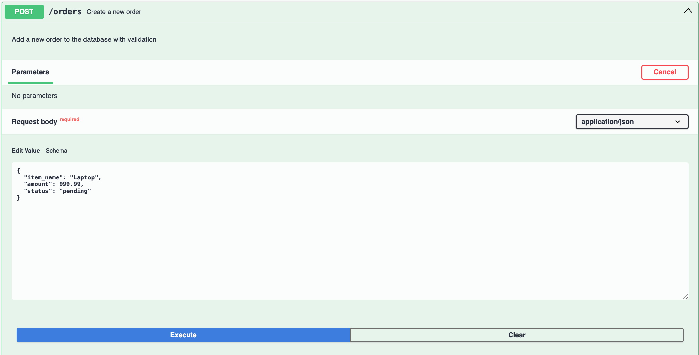

The POST interface shows the request body editor with example values pre-filled. You can edit the JSON directly and click Execute to create an order.

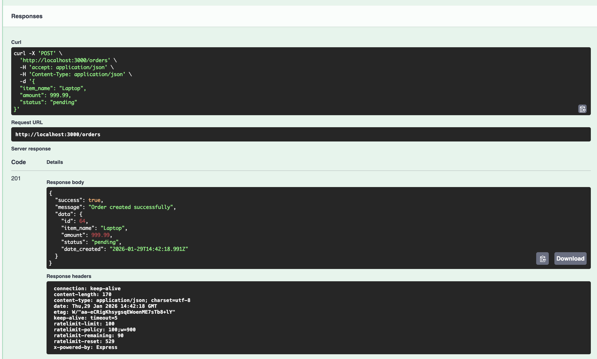

A successful response shows:
- **Status 201 Created**
- The generated **curl command** for replication
- **Response body** with the new order including auto-generated `id` and `date_created`
- **Response headers** with rate limit information

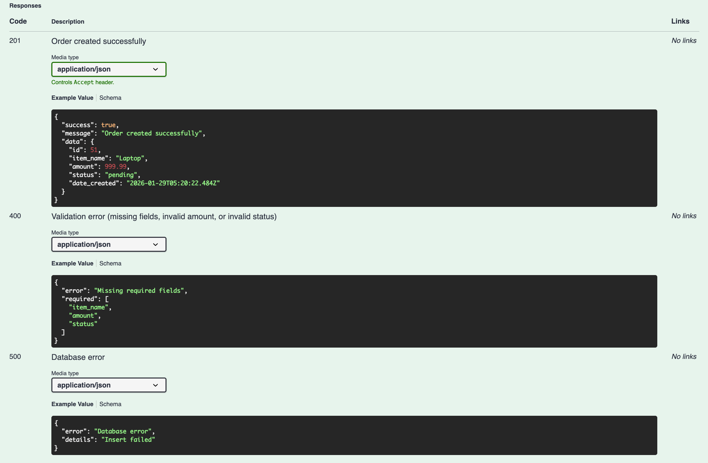

As shown in the screenshot, possible responses include: 201 (success), 400 (validation error), and 500 (database error).

---

## ✏️ 3. PUT /orders/{id} - Update Order

Update the status and/or amount of an existing order.

### Path Parameters

| Parameter | Type | Required | Description |
|-----------|------|----------|-------------|
| `id` | integer | Yes | Order ID to update |

### Request Body (Optional Fields)

```json
{
  "amount": 1299.99,    // Optional: new amount
  "status": "shipped"   // Optional: new status
}
```

### Response (200 OK)

```json
{
  "success": true,
  "message": "Order updated successfully",
  "data": {
    "id": 8,
    "item_name": "Laptop",       // Unchanged
    "amount": 1299.99,           // Updated
    "status": "shipped",         // Updated
    "date_created": "2026-01-15T..." // Unchanged
  }
}
```

### Examples

```bash
# Update status only
curl -X PUT http://localhost:3000/orders/1 -H "Content-Type: application/json" -d '{"status": "shipped"}'

# Update both fields
curl -X PUT http://localhost:3000/orders/1 -H "Content-Type: application/json" -d '{"amount": 1299.99, "status": "delivered"}'
```

### Swagger UI - PUT /orders/{id}

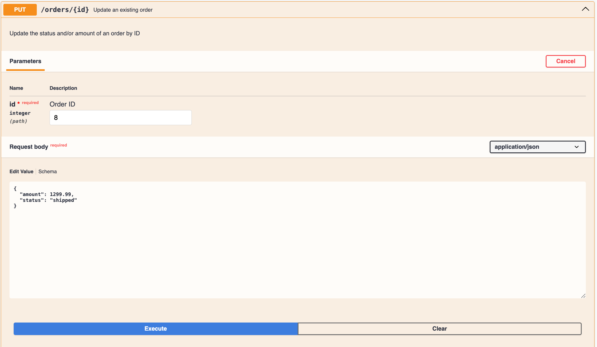

The PUT interface shows:
- **Path parameter** (id) - the order ID to update
- **Request body** - optional fields for amount and status

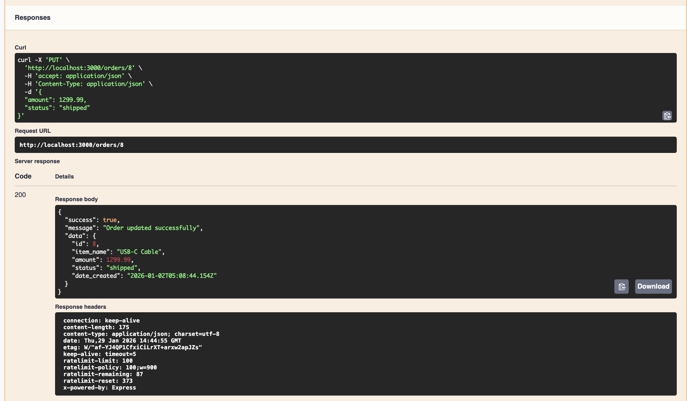

Response shows the updated order with new values. The `item_name` and `date_created` fields remain unchanged.

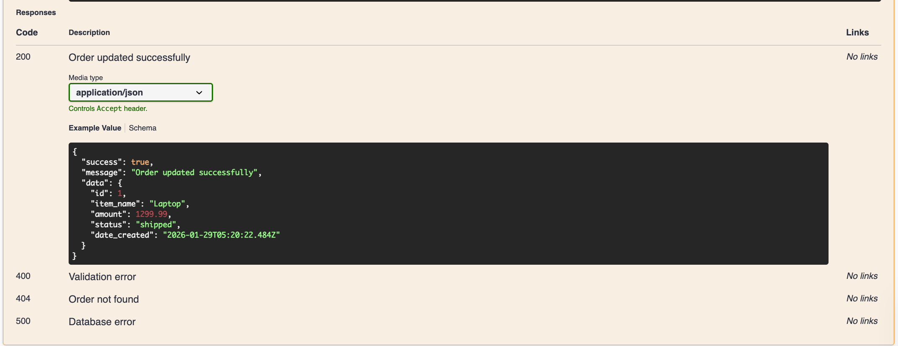

As shown in the screenshot, error responses include: 400 (invalid values), 404 (order not found), 500 (database error).

---

## 🗑️ 4. DELETE /orders/{id} - Delete Order

Permanently remove an order from the database.

### Path Parameters

| Parameter | Type | Required | Description |
|-----------|------|----------|-------------|
| `id` | integer | Yes | Order ID to delete |

### Response Codes

| Code | Description |
|------|-------------|
| `204` | No Content - Order deleted successfully |
| `404` | Not Found - No order with given ID |
| `500` | Database error |

### Examples

```bash
# Successful deletion
curl -X DELETE http://localhost:3000/orders/62

# Attempting to delete non-existent order
curl -X DELETE http://localhost:3000/orders/999
```

### Swagger UI - DELETE /orders/{id}

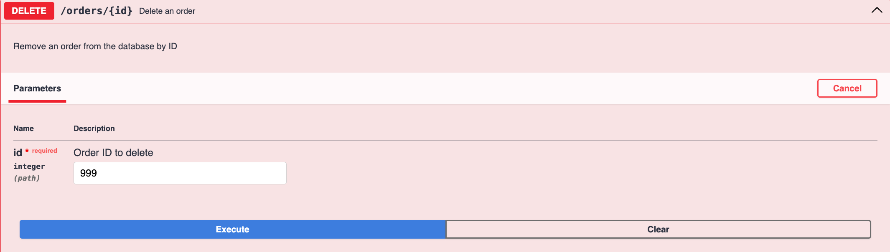

The DELETE interface (styled in red to indicate destructive action) shows only the required path parameter `id`. No request body is needed.

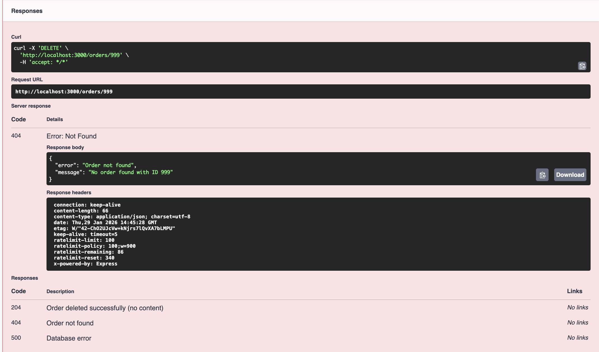

This screenshot shows the 404 response when attempting to delete a non-existent order (ID 999). The error message clearly indicates "No order found with ID 999".

---

## 📤 5. GET /orders/export - Export Data

Export all orders as a downloadable CSV or JSON file.

### Query Parameters

| Parameter | Type | Required | Values |
|-----------|------|----------|--------|
| `format` | string | Yes | `csv` or `json` |

### Response Headers

| Format | Content-Type | Content-Disposition |
|--------|--------------|---------------------|
| CSV | `text/csv; charset=utf-8` | `attachment; filename=orders.csv` |
| JSON | `application/json` | `attachment; filename=orders.json` |

### Examples

```bash
# Export as CSV
curl "http://localhost:3000/orders/export?format=csv" -o orders.csv

# Export as JSON
curl "http://localhost:3000/orders/export?format=json" -o orders.json
```

### Swagger UI - GET /orders/export

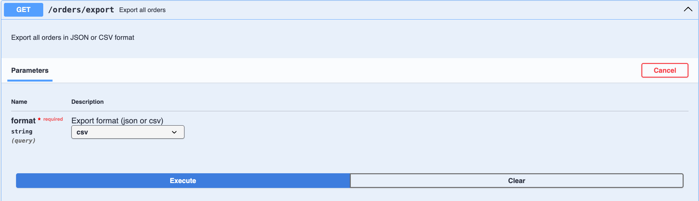

The export endpoint shows the required `format` parameter with dropdown options for `csv` or `json`.

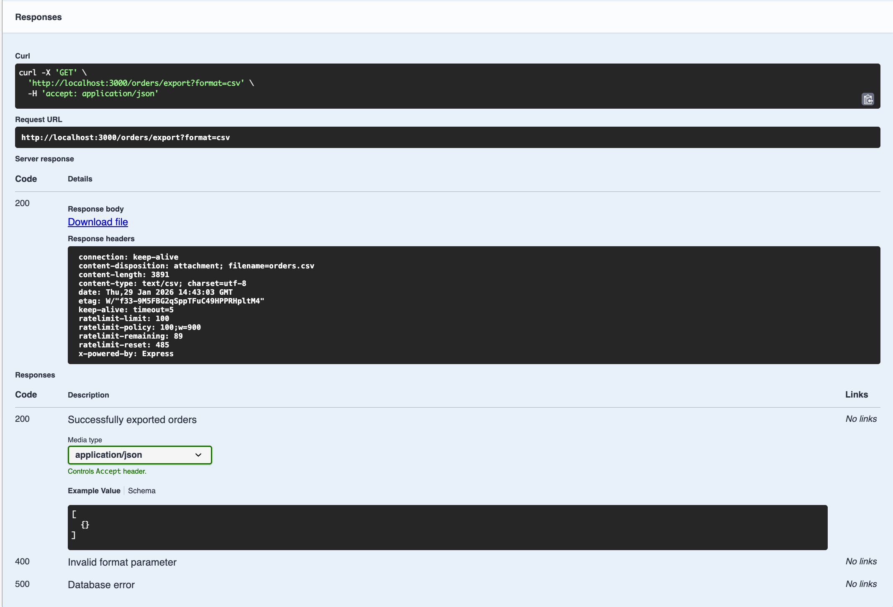

CSV export response shows:
- **Download file** link to download orders.csv
- **Response headers** with `content-disposition: attachment; filename=orders.csv`

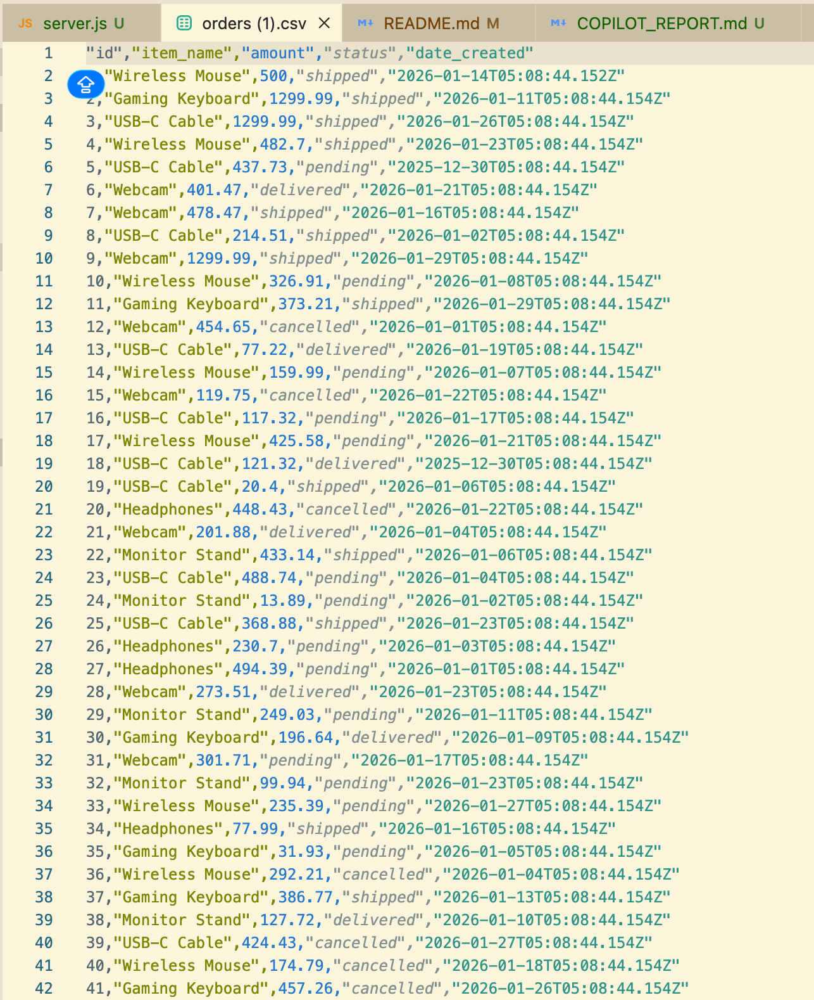

The downloaded CSV file shows all orders with proper formatting: headers on first row, quoted string values.

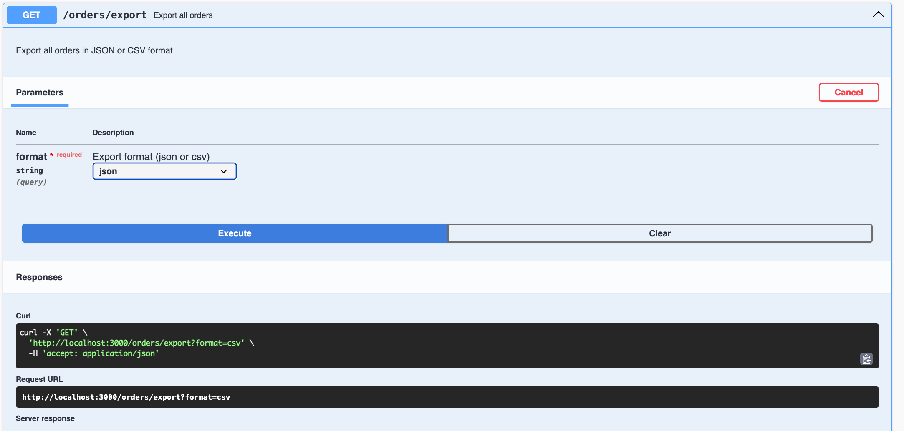

JSON export shows similar structure with download link for orders.json.

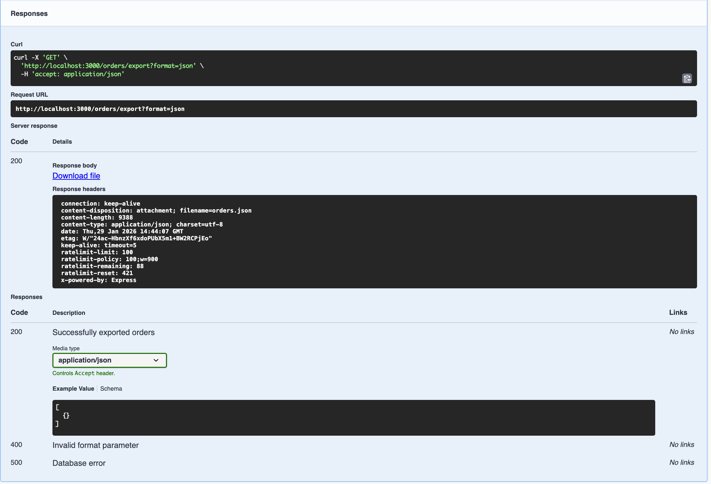

As shown in the screenshot, the export endpoint also handles error responses for invalid format parameters.

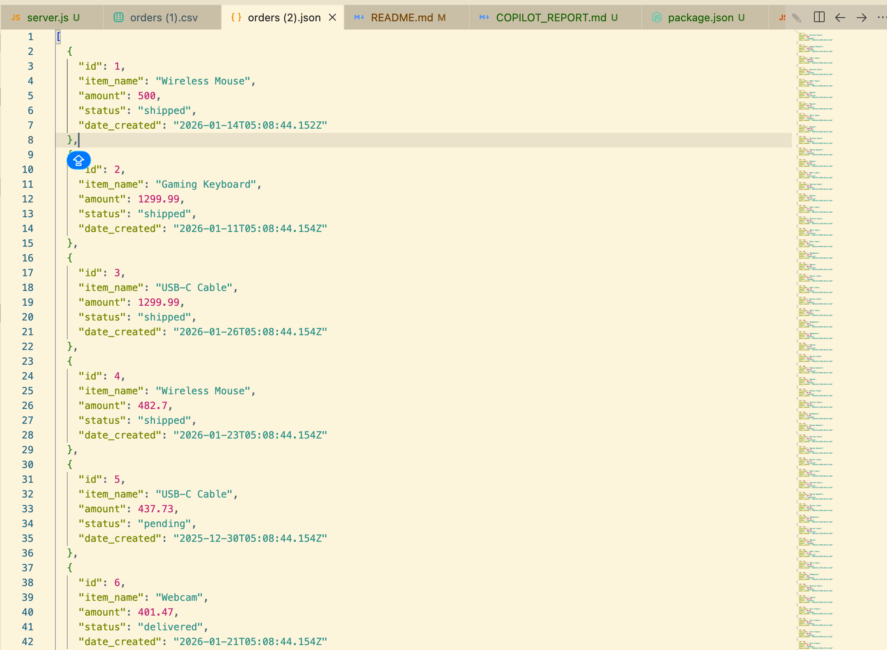

The downloaded JSON file is pretty-printed with 2-space indentation for readability.

---

## 🧪 Testing

The project includes a comprehensive test suite with **21 automated tests** built with **Jest** and **Supertest**. The tests cover all CRUD operations, pagination, filtering, and edge cases to ensure the API behaves correctly in all scenarios.

### Test Summary

| Category | Tests | Coverage |
|----------|-------|----------|
| **CRUD Operations (POST)** | 6 | Create orders, input validation, error handling |
| **Pagination (GET)** | 4 | Default behavior, custom limits, page navigation |
| **Filtering (GET)** | 5 | Status, amount range, combined filters |
| **Date Filtering (GET)** | 4 | Date range queries, boundary conditions |
| **Edge Cases** | 2 | Invalid parameters, graceful degradation |
| **Total** | **21** | **100% endpoint coverage** |

---

### 📝 CRUD Operations Tests (6 Tests)

These tests verify the **Create** operation through the POST /orders endpoint, ensuring proper validation and error handling.

#### Test 1: Successful Order Creation
```javascript
test('Should create a new order successfully (201 status)')
```
**What it tests:**
- Sending a valid request with `item_name`, `amount`, and `status`
- Server responds with HTTP 201 Created
- Response includes auto-generated `id` and `date_created`
- Response body has `success: true` and the complete order object

**Request:**
```json
{ "item_name": "Test Item", "amount": 99.99, "status": "pending" }
```
**Expected:** 201 status, order object with generated ID

---

#### Test 2: Missing item_name Validation
```javascript
test('Should fail if item_name is missing (400 status)')
```
**What it tests:**
- Sending a request without the `item_name` field
- Server correctly identifies the missing required field
- Returns descriptive error message

**Request:**
```json
{ "amount": 99.99, "status": "pending" }
```
**Expected:** 400 status, error: "Missing required fields"

---

#### Test 3: Missing amount Validation
```javascript
test('Should fail if amount is missing (400 status)')
```
**What it tests:**
- Sending a request without the `amount` field
- Server validates all required fields are present

**Request:**
```json
{ "item_name": "Test", "status": "pending" }
```
**Expected:** 400 status, error: "Missing required fields"

---

#### Test 4: Negative Amount Validation
```javascript
test('Should fail if amount is negative (400 status)')
```
**What it tests:**
- Sending a request with a negative amount value
- Server validates that amount must be positive

**Request:**
```json
{ "item_name": "Test", "amount": -50, "status": "pending" }
```
**Expected:** 400 status, error: "Invalid amount"

---

#### Test 5: Zero Amount Validation
```javascript
test('Should fail if amount is zero (400 status)')
```
**What it tests:**
- Sending a request with amount = 0
- Server correctly rejects zero as an invalid amount
- **Important edge case:** JavaScript treats 0 as falsy, but our validation specifically checks for this

**Request:**
```json
{ "item_name": "Test", "amount": 0, "status": "pending" }
```
**Expected:** 400 status, error: "Invalid amount"

---

#### Test 6: Invalid Status Validation
```javascript
test('Should fail with invalid status (400 status)')
```
**What it tests:**
- Sending a request with a status not in the allowed values
- Server validates status against whitelist: `pending`, `shipped`, `delivered`, `cancelled`

**Request:**
```json
{ "item_name": "Test", "amount": 50, "status": "processing" }
```
**Expected:** 400 status, error: "Invalid status"

---

### 📄 Pagination Tests (4 Tests)

These tests verify the pagination functionality of GET /orders, ensuring proper data slicing and navigation.

#### Test 7: Default Pagination Behavior
```javascript
test('Should return 10 orders by default')
```
**What it tests:**
- Calling GET /orders without any query parameters
- Server applies default pagination: page=1, limit=10
- Response includes exactly 10 orders
- Pagination metadata is accurate

**Request:** `GET /orders`
**Expected:** 200 status, 10 orders in data array, correct pagination object

---

#### Test 8: Custom Limit Parameter
```javascript
test('Should return 5 orders when limit=5')
```
**What it tests:**
- Custom limit parameter is respected
- Returns exactly the requested number of items
- Pagination metadata reflects the custom limit

**Request:** `GET /orders?limit=5`
**Expected:** 200 status, exactly 5 orders, `pagination.limit: 5`

---

#### Test 9: Page Navigation
```javascript
test('Should return the correct page 2 results')
```
**What it tests:**
- Navigating to page 2 returns different orders than page 1
- OFFSET calculation works correctly (page 2, limit 10 = offset 10)
- Orders are correctly sliced from the dataset

**Request:** `GET /orders?page=2`
**Expected:** 200 status, orders 11-20 from dataset, `pagination.page: 2`

---

#### Test 10: Empty Page Handling
```javascript
test('Should handle page 999 gracefully (empty array, not error)')
```
**What it tests:**
- Requesting a page beyond available data
- Server returns empty array, not an error
- This is a graceful degradation pattern

**Request:** `GET /orders?page=999`
**Expected:** 200 status, empty data array `[]`, `pagination.page: 999`

---

### 🔍 Filtering Tests (5 Tests)

These tests verify the filtering functionality of GET /orders, covering status filters, amount ranges, and combinations.

#### Test 11: Filter by Status (pending)
```javascript
test('Should filter by status=pending')
```
**What it tests:**
- Status filter correctly filters orders
- Only orders with "pending" status are returned
- Database WHERE clause works correctly

**Request:** `GET /orders?status=pending`
**Expected:** 200 status, all returned orders have `status: "pending"`

---

#### Test 12: Filter by Status (shipped)
```javascript
test('Should filter by status=shipped')
```
**What it tests:**
- Status filter works for different status values
- Verifies filter is not hardcoded to a single value

**Request:** `GET /orders?status=shipped`
**Expected:** 200 status, all returned orders have `status: "shipped"`

---

#### Test 13: Amount Range Filter
```javascript
test('Should filter by min_amount and max_amount')
```
**What it tests:**
- Both min_amount and max_amount filters work together
- Boundary values are inclusive (>= min, <= max)
- Range filtering in SQL works correctly

**Request:** `GET /orders?min_amount=50&max_amount=150`
**Expected:** 200 status, all orders have amount between 50 and 150 (inclusive)

---

#### Test 14: Empty Filter Results
```javascript
test('Should return empty list if no orders match filters')
```
**What it tests:**
- When filters match no orders, API returns empty array
- No error is thrown for zero results
- Pagination shows totalRecords: 0

**Request:** `GET /orders?min_amount=999999`
**Expected:** 200 status, empty data array `[]`, `pagination.totalRecords: 0`

---

#### Test 15: Combined Filters
```javascript
test('Should combine multiple filters (status + amount range)')
```
**What it tests:**
- Multiple filters can be applied simultaneously
- AND logic is used (all conditions must match)
- Complex WHERE clauses are built correctly

**Request:** `GET /orders?status=pending&min_amount=100&max_amount=500`
**Expected:** 200 status, orders matching ALL criteria

---

### 📅 Date Filtering Tests (4 Tests)

These tests verify date range filtering functionality, testing the start_date and end_date parameters.

#### Test 18: Date Range Filter
```javascript
test('Should filter by date range')
```
**What it tests:**
- Both start_date and end_date filters work together
- Date comparison uses SQLite date() function
- Orders within the range are returned

**Request:** `GET /orders?start_date=2026-01-01&end_date=2026-01-31`
**Expected:** 200 status, orders created within January 2026

---

#### Test 19: Empty Date Range Results
```javascript
test('Should return empty if no orders in date range')
```
**What it tests:**
- Date range with no matching orders returns empty array
- No errors for zero results in date filtering

**Request:** `GET /orders?start_date=1999-01-01&end_date=1999-12-31`
**Expected:** 200 status, empty data array `[]`

---

#### Test 20: Start Date Only Filter
```javascript
test('Should filter by start_date only')
```
**What it tests:**
- Using only start_date without end_date
- Returns orders created on or after the specified date
- Open-ended date range works correctly

**Request:** `GET /orders?start_date=2026-01-15`
**Expected:** 200 status, orders from Jan 15, 2026 onwards

---

#### Test 21: End Date Only Filter
```javascript
test('Should filter by end_date only')
```
**What it tests:**
- Using only end_date without start_date
- Returns orders created on or before the specified date
- Open-ended date range works correctly

**Request:** `GET /orders?end_date=2026-01-15`
**Expected:** 200 status, orders up to and including Jan 15, 2026

---

### ⚠️ Edge Case Tests (2 Tests)

These tests verify graceful handling of invalid or unexpected input.

#### Test 16: Invalid Page Parameter
```javascript
test('Should handle invalid page parameter gracefully')
```
**What it tests:**
- Non-numeric page parameter (e.g., "abc")
- Server defaults to page 1 instead of crashing
- Type coercion and fallback logic

**Request:** `GET /orders?page=abc`
**Expected:** 200 status, defaults to page 1, no error

---

#### Test 17: Invalid Limit Parameter
```javascript
test('Should handle invalid limit parameter gracefully')
```
**What it tests:**
- Non-numeric limit parameter
- Server defaults to limit 10 instead of crashing
- Prevents SQL injection through numeric params

**Request:** `GET /orders?limit=xyz`
**Expected:** 200 status, defaults to limit 10, no error

---

### 🚀 Running Tests

```bash
# Run all tests
npm test

# Run tests with verbose output
npm test -- --verbose

# Run tests in watch mode (development)
npm test -- --watch
```

### Test Output Screenshot

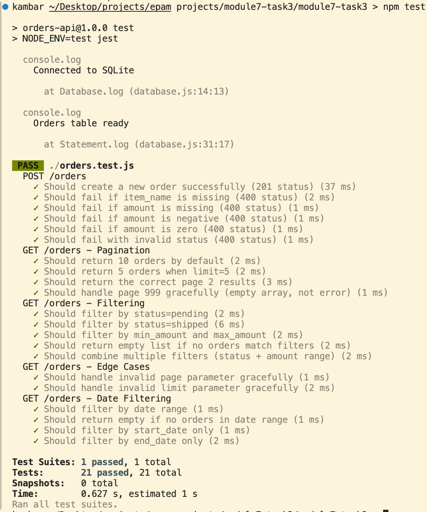

**Test Execution Analysis:**

The screenshot shows the complete Jest test output in the terminal:

1. **Command Executed**: `npm test` which runs `NODE_ENV=test jest`
   - The `NODE_ENV=test` flag ensures the server doesn't start listening (prevents port conflicts)
   
2. **Database Initialization Logs**:
   - `Connected to SQLite` - In-memory database created
   - `Orders table ready` - Schema applied and test data seeded

3. **Test Results by Category**:
   ```
   PASS  ./orders.test.js
   
   POST /orders
     ✓ Should create a new order successfully (201 status) (37 ms)
     ✓ Should fail if item_name is missing (400 status) (2 ms)
     ✓ Should fail if amount is missing (400 status) (1 ms)
     ✓ Should fail if amount is negative (400 status) (1 ms)
     ✓ Should fail if amount is zero (400 status) (1 ms)
     ✓ Should fail with invalid status (400 status) (1 ms)
   
   GET /orders - Pagination
     ✓ Should return 10 orders by default (2 ms)
     ✓ Should return 5 orders when limit=5 (2 ms)
     ✓ Should return the correct page 2 results (3 ms)
     ✓ Should handle page 999 gracefully (empty array, not error) (1 ms)
   
   GET /orders - Filtering
     ✓ Should filter by status=pending (2 ms)
     ✓ Should filter by status=shipped (6 ms)
     ✓ Should filter by min_amount and max_amount (2 ms)
     ✓ Should return empty list if no orders match filters (2 ms)
     ✓ Should combine multiple filters (status + amount range) (2 ms)
   
   GET /orders - Edge Cases
     ✓ Should handle invalid page parameter gracefully (1 ms)
     ✓ Should handle invalid limit parameter gracefully (2 ms)
   
   GET /orders - Date Filtering
     ✓ Should filter by date range (1 ms)
     ✓ Should return empty if no orders in date range (1 ms)
     ✓ Should filter by start_date only (1 ms)
     ✓ Should filter by end_date only (2 ms)
   ```

4. **Summary Metrics**:
   - **Test Suites**: 1 passed, 1 total
   - **Tests**: 21 passed, 21 total (100% pass rate)
   - **Snapshots**: 0 total
   - **Time**: 0.627 seconds (fast execution)

### Test Configuration Details

#### In-Memory Database

Tests use **SQLite in-memory mode** (`:memory:`):

```javascript
// In test setup
const db = new sqlite3.Database(':memory:');
```

**Benefits:**
- **Isolation**: Tests don't affect the production `orders.db` file
- **Speed**: In-memory operations are significantly faster than disk I/O
- **Reproducibility**: Fresh database state for each test run
- **No Cleanup**: Database disappears when tests complete

#### Test Environment Setup

```javascript
// package.json script
"test": "NODE_ENV=test jest"
```

The `NODE_ENV=test` environment variable:
- Prevents the Express server from calling `app.listen()`
- Allows Supertest to bind to the app directly
- Avoids "port already in use" errors during testing

#### Test Structure

```javascript
const request = require('supertest');
const app = require('./server');

describe('POST /orders', () => {
  test('Should create a new order successfully', async () => {
    const response = await request(app)
      .post('/orders')
      .send({ item_name: 'Test', amount: 99.99, status: 'pending' })
      .expect(201);
    
    expect(response.body.success).toBe(true);
    expect(response.body.data.id).toBeDefined();
  });
});

---

## 🛡️ Rate Limiting

The API includes rate limiting to protect against abuse and ensure fair usage.

### Configuration

| Setting | Value |
|---------|-------|
| **Window Duration** | 15 minutes |
| **Max Requests** | 100 per window |
| **Scope** | Per IP address |
| **Protected Routes** | All `/orders` endpoints |

### Response Headers

Every response includes rate limit information:

```http
RateLimit-Limit: 100
RateLimit-Remaining: 97
RateLimit-Reset: 827
RateLimit-Policy: 100;w=900
```

| Header | Description |
|--------|-------------|
| `RateLimit-Limit` | Maximum requests allowed |
| `RateLimit-Remaining` | Requests remaining in current window |
| `RateLimit-Reset` | Seconds until limit resets |
| `RateLimit-Policy` | Policy configuration (100 requests per 900 seconds) |

### Rate Limit Exceeded Response

When you exceed the limit:

**Status**: `429 Too Many Requests`

```json
{
  "error": "Too many requests",
  "message": "You have exceeded the 100 requests in 15 minutes limit!",
  "retryAfter": "15 minutes"
}
```

---

## 🔒 Security Features

| Feature | Implementation | Protection Against |
|---------|---------------|-------------------|
| **Parameterized Queries** | All SQL uses `?` placeholders | SQL Injection |
| **Input Validation** | All fields validated before processing | Malformed data, type errors |
| **Rate Limiting** | 100 req/15min per IP | DoS, brute force attacks |
| **Whitelist Sorting** | Sort fields validated against allowed list | SQL injection via sorting |
| **Error Sanitization** | Internal errors not exposed to clients | Information disclosure |
| **Type Coercion** | Numeric params converted and validated | Type confusion attacks |

### SQL Injection Prevention Example

```javascript
// ❌ Vulnerable (never do this)
const query = `SELECT * FROM orders WHERE status = '${status}'`;

// ✅ Safe (parameterized query)
const query = 'SELECT * FROM orders WHERE status = ?';
db.all(query, [status], callback);
```

---

## 🗂️ Project Structure

```
module7-task3/
├── 📄 database.js           # SQLite connection and schema definition
├── 📄 server.js             # Express app, routes, middleware (750+ lines)
├── 📄 seed.js               # Database seeding script (50 orders)
├── 📄 orders.test.js        # Jest test suite (21 tests)
├── 📦 orders.db             # SQLite database (created by seed.js)
├── 📄 package.json          # Dependencies and npm scripts
├── 📁 screenshots/          # API documentation screenshots (19 files)
│   ├── swagger-overview.png
│   ├── get-orders-*.png
│   ├── post-orders-*.png
│   ├── orders-put-*.png
│   ├── delete-orders-*.png
│   ├── orders-export-*.png
│   └── jest-test-output-terminal.png
├── 📄 COPILOT_REPORT.md     # GitHub Copilot metrics report
└── 📄 README.md             # This comprehensive documentation
```

---

## 🛠️ Tech Stack

| Category | Technology | Version | Purpose |
|----------|------------|---------|---------|
| **Runtime** | Node.js | v18+ | JavaScript runtime |
| **Framework** | Express.js | v5.2.1 | Web application framework |
| **Database** | SQLite3 | v5.1.7 | Embedded SQL database |
| **Testing** | Jest | v29.7.0 | Test runner and assertions |
| **Testing** | Supertest | v6.3.4 | HTTP testing library |
| **Documentation** | swagger-ui-express | v5.x | Swagger UI middleware |
| **Documentation** | swagger-jsdoc | v6.x | JSDoc to OpenAPI generator |
| **Security** | express-rate-limit | v7.x | Rate limiting middleware |
| **Export** | json2csv | v6.x | JSON to CSV converter |
| **Development** | Nodemon | v3.0.3 | Auto-reload on file changes |

---

## 📝 Database Schema

### `orders` Table

```sql
CREATE TABLE orders (
    id           INTEGER PRIMARY KEY AUTOINCREMENT,
    item_name    TEXT    NOT NULL,
    amount       REAL    NOT NULL,
    status       TEXT    NOT NULL,
    date_created TEXT    NOT NULL
);
```

### Column Details

| Column | Type | Constraints | Description |
|--------|------|-------------|-------------|
| `id` | INTEGER | PRIMARY KEY, AUTOINCREMENT | Unique identifier, auto-generated |
| `item_name` | TEXT | NOT NULL | Name of the ordered product |
| `amount` | REAL | NOT NULL | Order price (supports decimals) |
| `status` | TEXT | NOT NULL | Order status (pending/shipped/delivered/cancelled) |
| `date_created` | TEXT | NOT NULL | ISO 8601 timestamp of creation |

### Sample Data

```sql
INSERT INTO orders (item_name, amount, status, date_created) VALUES
('Wireless Mouse', 49.99, 'pending', '2026-01-29T10:30:00.000Z'),
('Gaming Keyboard', 149.99, 'shipped', '2026-01-28T14:45:00.000Z'),
('USB-C Hub', 79.99, 'delivered', '2026-01-27T09:15:00.000Z');
```

---
